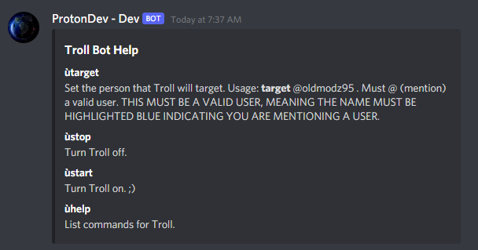

<h1 align="center">

OldModz95

</h1>
<p align="center">
  <a href="https://discord.gg/MS6TMgRfqB"></a>
</p>
<p align="center">
  <a href="https://discord.gg/M3sTyHtcK4"></a>
</p>

<br>

### Bot Discord Troll Vocal By OldModz95 Proposed By ProtonDev
-This bot allows to follow the user by voice and as soon as he speaks, the bot speaks with the mp3 file.<br>
-Ce bot permet de suivre l'utilisateur en vocal et des qu'il parle, le bot parle avec le fichier mp3.
<br><br>

## REJOIGNIEZ LE SERVEUR DISCORD - JOIN SERVER DISCORD!!!!!!!!!!!!!!!!!!!!!!!!

https://discord.gg/MS6TMgRfqB
<br><br>


## Installation
<br>

Aller dans le fichier .env/Go to file .env:
```
Add Token Bot Discord
```

<br>

File/Fichier  - Line/Ligne 9 index.js

`const prefix = 'ù';`

<br><br>

## Information Modules

```
discord.js: 12.5.3
@discordjs/opus: 0.5.0
dotenv: 10.0.0
ffmpeg-static: 4.3.0
```

<br><br>

## Information Commands

```
target: Troll mention user
start: start troll
stop: stop troll
```

<br>

### Note:

Change file mp3 line 127 `dispatcher = connection.play('./ntm.mp3')`

If you are having errors/problems with starting delete the `package.json` file and do, before you install the packages `npm init`

<br><br>




<br>


<br>
<br>

# Install NodeJS
<br>

[Download NodeJS](https://nodejs.org/en/)


<br>
<br>

<br>

## Video Tutoriel

```
Bientôt disponible
Soon...
```


<br>
<br>

<br>

## IMAGE

<br>

# Commands Help

<br>


<br><br>


## 📞 Contact me

[Discord](https://www.discord.gg/MS6TMgRfqB)
[Twitter](https://twitter.com/oldmodz95)
<br>
[YouTube (Server Private)](https://exotique.fr2.quickconnect.to/?launchApp=SYNO.SDS.VideoStation.AppInstance#!libOldModz95/N4IgNglgRgTghjAniAXCAFgewLYFMD6AbhACa6YC0A7CADQgDGcALrgOaZKohxhh0gADnDa5UARgC+QA)
<p>Username: ytb <br>
Password: oldmodz95</p>

<br />

## 🔧 Technologies & Tools


###### Version control system


###### License


###### Operating systems


## &#x1f4c8; GitHub Stats

<a href="https://github.com/OldModz95-YTB">
  
</>
<a href="https://github.com/OldModz95-YTB">
  
</a>

<p align="left">  </p>
